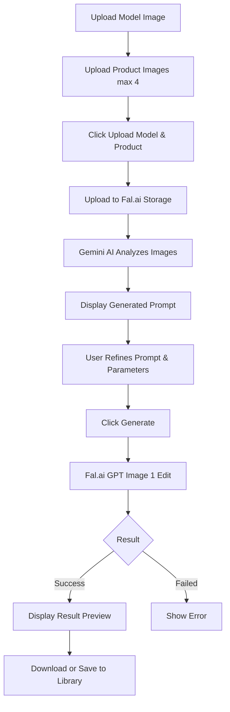

# Studio AI - Living Specification (Tài Liệu Sống)

> [!CAUTION]
> **LIVING DOCUMENT**: Tài liệu này không cố định! Nó phản ánh **trạng thái hiện tại** của dự án.
> Mọi thay đổi về tính năng, workflow so với thiết kế ban đầu (Original Spec) PHẢI được cập nhật vào đây ngay lập tức.
> **Mục đích**: Source of Truth cho Dev hiện tại & Future Team. Tránh việc tính năng bị "lạc trôi" hoặc code sai lệch so với thực tế.

**Last Updated**: 2026-01-14
**Based on Original Spec**: v1.3

---

## 1. Feature Status Overview

| Feature Group | Feature Name | Priority | Status | Deviation from Original |
| :--- | :--- | :--- | :--- | :--- |
| **Foundation** | **Auth & RBAC** | P0 | ✅ **Done** | Added `avatar` to Users table. Use `firstOrCreate` for seeders. |
| **Foundation** | **Registration Approval** | P0 | ✅ **Done** | NEW: Admin approval workflow for new users. |
| **Foundation** | **Models & DB** | P0 | ✅ **Done** | Fixed Migration Order logic. |
| **Foundation** | **User Management** | P1 | ✅ **Enhanced** | Admin CRUD & Lock. Added Manual Credit Adjustment. |
| **Storage Hub** | **Prompt Library** | P1 | ✅ **Done** | Search, Filter, Sort, Duplicate, Edit, Image Thumbnails. |
| **Storage Hub** | **Image Library** | P1 | ✅ **Done** | Auto-sync from Prompt Creation. Gallery Grid. |
| **Storage Hub** | **Model Library** | P1 | ✅ **Done** | Admin-only Management, User Read-only. |
| **Feature** | **Prompt Creation** | P1 | ✅ **Done** | 3-pane workflow, Edit Mode support, Image Reference storage. |
| **Feature** | **Activity History** | P1 | ✅ **Enhanced** | NEW: Image preview (Viewer.js), Admin view-all, Admin delete. |
| **Feature** | **Batch Processor** | P1 | ⏳ Pending | - |
| **Feature** | **Product Staging** | - | ❌ **Removed** | Feature deprecated and removed. |
| **Feature** | **Products Virtual** | P1 | ✅ **Enhanced** | Hybrid Workflow, Integrated Prompt Library, Quota System. |
| **System** | **Subscription & Credits** | P0 | ✅ **Done** | Credit Logic, Plan Management, Admin Request Workflow. |
| **System** | **Module Access** | P0 | ✅ **Done** | Middleware protection, Hierarchical overrides. |
| **UI/UX** | **Navigation Credits** | P2 | ✅ **Done** | NEW: Credit balance badge in navigation bar. |
| **UI/UX** | **Auth Pages** | P2 | ✅ **Enhanced** | NEW: Register link on login page. |

---

## 2. Detailed Feature Specifications (Current State)

### 2.1 Authentication & Permissions
- **Status**: Hoàn tất Phase 1.
- **Implementation**: Laravel Breeze + Spatie.
- **Roles**: Admin, Manager, User (Đã seed).
- **Current Logic**:
    - User chỉ thấy data của mình.
    - Manager thấy all data nhưng chỉ edit được System Libs.
    - Admin sờ được mọi thứ.

### 2.2 Storage Hub (Sắp triển khai)
*(Giữ nguyên logic từ Spec v1.3, cập nhật Access Control)*
- **Prompt Library**: Store prompts with `wizard_data` JSON. Track `creation_method`.
    - **Access Control**: Chỉ Owner & Admin có quyền Edit/Delete.
    - **Duplication**: Người nhân bản sẽ trở thành **Owner** của bản sao mới (Full Rights). User khác chỉ được View/Use.
- **Image Library**: Display Only. Viewer.js integration.
    - **Access Control**: Chỉ Owner & Admin có quyền Delete.
- **Model Library**: System Models only for now (Admin managed).

### 2.3 Auto Prompt Wizard
*(Giữ nguyên logic từ Spec v1.3)*
- 5 Steps: Core Info -> Presenting -> Technical -> Polish -> Finish.
- **Note**: Will need dynamic options API.

### 2.4 AI Engines (Batch / Staging / Virtual Model)
*(Giữ nguyên logic từ Spec v1.3)*
- **Batch Processor**: Gemini Vision analyze -> Fal.ai generate.
- **Queue System**: Cần đảm bảo dùng Queue database driver để xử lý job lâu dài.

---

## 3. Log Thay Đổi Tính Năng (Change Log)
*Format: [Date] [Feature] - Nội dung thay đổi so với kế hoạch ban đầu*

- **2026-01-10**:
    - [RBAC] Chốt phương án sử dụng `firstOrCreate` cho Seeder để đảm bảo tính Idempotent (Chạy nhiều lần không lỗi).
    - [Database] Xác định `batches` chạy sau `products` để tránh lỗi khóa ngoại.
    - [User] Thêm trường `avatar` trực tiếp vào bảng `users` thay vì tách bảng profile riêng (Simplification).
    - [Admin] Triển khai **User Management** (CRUD, Lock, Assign Roles) vào core system.

- **2026-01-14**:
    - [Products Virtual] Triển khai tính năng Virtual Try-On với workflow hybrid (Gemini + Fal.ai).
    - [Fal.ai Storage] Chuyển sang sử dụng Fal.ai Storage API thay vì Base64 Data URL.
    - [Quota System] Implement user quota tracking với daily/total limits và auto-reset.
    - [UI/UX] Thêm Alpine.js state machine cho Products Virtual workflow.
    - [Enhancement] Tích hợp Prompt Library Selector (Modal UI Pro Max).
    - [Fix] Ổn định hóa quy trình xử lý file local (Dev Mode) và Route Routing.
    - [Fix] Sửa lỗi workflow "Selected Prompt" và chuẩn hóa Debug Info theo Fal.ai API Standard.

### 6. Admin Management (New!)
*   **User Management**:
    *   **List**: Xem danh sách User, tìm kiếm, lọc theo Role.
    *   **Action**: Tạo mới, Chỉnh sửa thông tin, Reset mật khẩu.
    *   **Security**: Khóa (Lock) và mở khóa tài khoản.
    *   **Role**: Gán quyền Admin, Manager, User.

### 7. Refactoring (Maintenance)
*   **Image System**:
    *   **Centralized**: Gom tụ điểm lưu trữ về 1 folder duy nhất.
    *   **Display Logic**: Image Library chỉ hiển thị, nguồn ảnh từ Prompt Creation.
    *   **Fix**: Symbolic link repair.
    *   **Viewer**: Integrated Viewer.js for advanced image viewing.
    *   **Method Tracking**: Added `method` field to Prompts (Manual/Image/Wizard).
    *   **Removal**: Removed "Product Staging" feature to streamline scope.

---

## 4. Products Virtual Feature (New!)

### 4.1 Overview
**Products Virtual** là tính năng Virtual Try-On cho phép người dùng "mặc thử" sản phẩm lên model/scene.

### 4.2 Workflow



### 4.3 Technical Implementation

**Database:**
- `products_virtual_jobs` - Lưu lịch sử generation jobs
- `user_quotas` - Tracking quota cho mỗi user

**API Integration:**
1. **Fal.ai Storage API**: Upload images → Get public URLs
2. **Gemini AI**: Analyze images → Generate prompt
3. **Fal.ai GPT Image 1 Edit**: Generate final result

**Quota System:**
- Daily Limit: Configurable (default: 10)
- Total Limit: Configurable (default: 100)
- Admin: Unlimited (-1)
- Auto-reset: Daily count resets at midnight

**Routes:**
```
GET  /features/products-virtual              → index
POST /features/products-virtual/analyze     → analyze
POST /features/products-virtual/generate    → generate
GET  /features/products-virtual/{id}/status → status
POST /features/products-virtual/{id}/save-to-library → saveToLibrary
GET  /features/products-virtual/{id}/download → download
```

### 4.4 Key Features
- **Fal.ai Storage Integration**: No file size limits, stable URLs
- **Alpine.js State Machine**: Smooth UI/UX workflow
- **Quota Management**: Daily/Total limits với admin override
- **Result Actions**: Download hoặc Save to Library

### 4.5 Fal.ai Logic Update (2026-01-15)
- **Integration Standard**:
  - `fal.run` & `queue.fal.run` used for all model interactions.
  - `fal.media` used for direct file uploads.
  - `api.fal.ai` is strictly deprecated/banned.
- **Upload Strategy**: Direct multipart upload prioritized over Base64.
- **Documentation**: Updated `BLUEPRINT.md` & `PROJECT_KNOWLEDGE.md` to reflect these core architectural rules.

---

## 5. New Features (v0.4.0 - 2026-01-16)

### 5.1 Registration Approval Flow
**Status**: ✅ Implemented

**Workflow**:
1. User registers → Account created with `is_active = false`
2. Email notification sent to all Admins
3. User redirected to login with "pending approval" message
4. Login blocked until Admin activates account
5. Admin approves via Edit User page → `is_active = true`

**Files**:
- Notification: `app/Notifications/NewUserRegistration.php`
- Controller: `app/Http/Controllers/Auth/RegisteredUserController.php`
- Login Check: `app/Http/Requests/Auth/LoginRequest.php`

### 5.2 Activity History Enhancements
**Status**: ✅ Implemented

**Features**:
- **Image Preview**: Viewer.js integration (eye icon overlay, full-screen viewer)
- **Admin Access**: View ALL users' activity (not just own)
- **Admin Delete**: Delete any activity entry + associated thumbnail file

**Routes**:
```
GET    /history                → index (role-based filtering)
DELETE /history/{activityLog}  → destroy (Admin only)
```

### 5.3 Manual Credit Management
**Status**: ✅ Implemented

**Location**: Admin > Users > Edit User

**Feature**: Input field "Manual Credits (Current Balance)" allows Admin to directly set user's available credits.

**Logic**: Updates `UserSubscription::credits_remaining` directly.

**UI**: Section "Subscription & Credits" shows current plan and credit input.

### 5.4 UI/UX Improvements
**Status**: ✅ Implemented

**Changes**:
1. **Login Page**: Added "Register" link in footer (justify-between layout)
2. **Navigation Bar**: Credit balance badge (amber theme, coin icon, responsive)
   - Shows: `Credits: {amount}`
   - Hidden on small screens
   - Fetches from: `Auth::user()->activeSubscription->credits_remaining`

---

**Last Updated**: 2026-01-16
